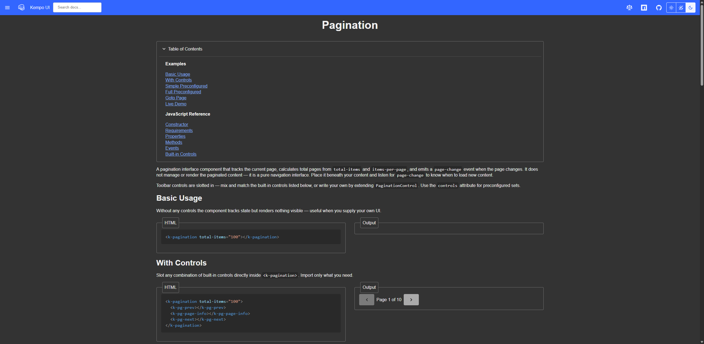
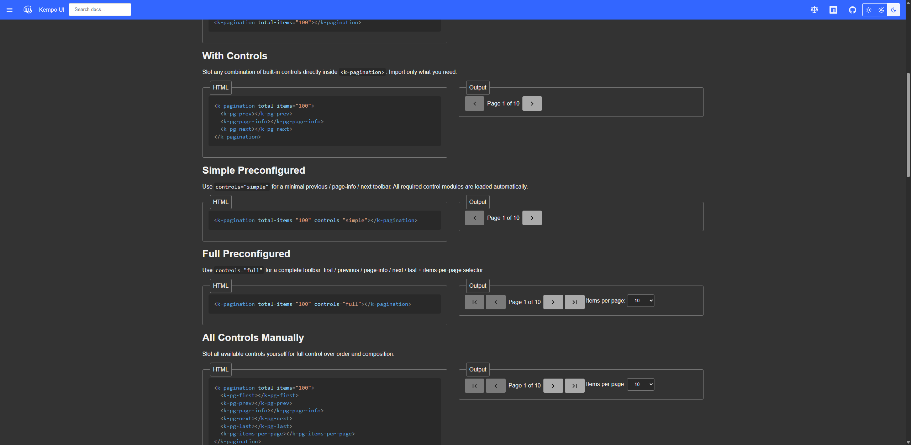
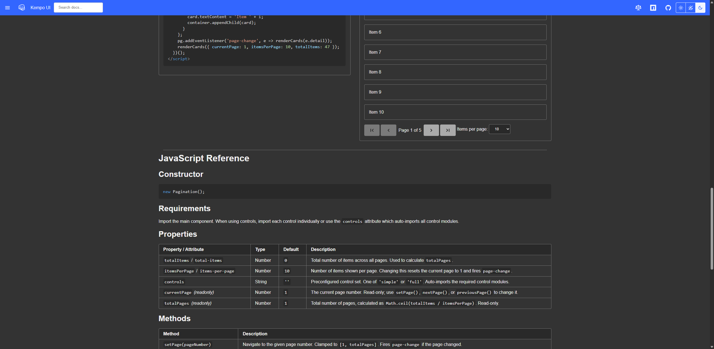
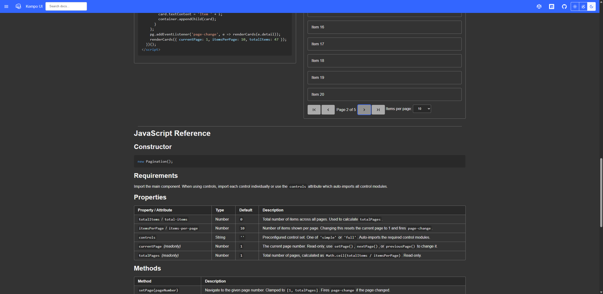
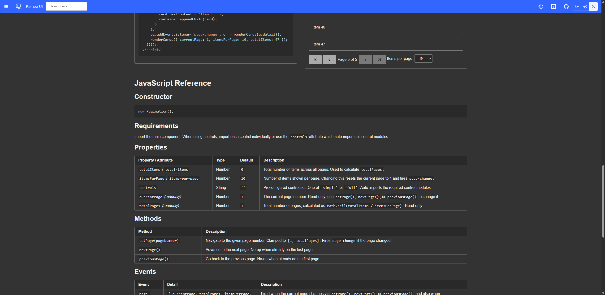
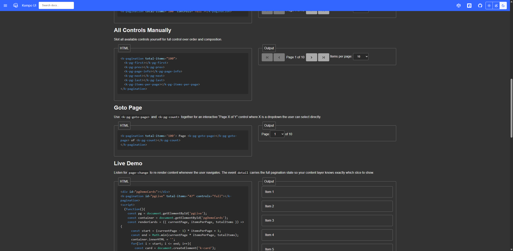
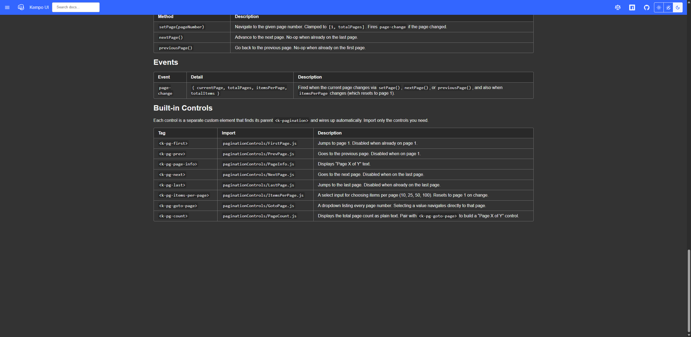

# 0006 - Create Pagination Component

## Status: Complete

## Dependency
None

## References
[styles](file:///c:\Users\dusti\.copilot\skills\styles\SKILL.md) - global skill for properly styling the component
[component-code](file:///c:\Users\dusti\.copilot\skills\component-code\SKILL.md) - global skill for coding kempo-ui components
[MarkdownEditor](../src/components/MarkdownEditor.js) - similar component pattern with control variants and preconfigured controls showing how to structure controls, make them interact with the primary component, and implement preconfigured control combinations

## Current State

No pagination component exists yet. Pagination functionality is not available to users.

## Aceptance Criteria

A new Pagination component should be created that:
- Acts as a UI interface component placed under content
- Does not manage the actual content being paginated
- Accepts attributes for total number of items, tems per page, and `page` the current page number.
- Calculates total number of pages from total items and items per page
- Displays and tracks the current page number
- Exposes public methods: `setPage(pageNumber)`, `nextPage()`, `previousPage()`
- Emits custom events when page changes so parent content can listen and update
- Has separate control components for common pagination controls (like HtmlEditor pattern)
- Includes preconfigured control variants for common use cases

### In-Scope
- `src/components/pagination.js` - main component
- `src/components/pagination-controls-*.js` - control component variants
- `docs-src/components/pagination.page.html` - documentation page
- `tests/components/pagination.test.js` - component tests

### Out of Scope
- Modifications to existing components
- Backend pagination logic or data fetching
- Content management or rendering within the pagination component itself

## Task Details

1. Set up the Pagination component using the component-setup skill
2. Implement the base Pagination component with:
   - Attributes: `totalItems` (total number of items) and `itemsPerPage` (items per page)
   - Getter properties: `currentPage` and `totalPages` (calculated from totalItems and itemsPerPage)
   - Internal tracking of current page (default to page 1)
   - Display of page information (e.g., "Page 3 of 10")
   - Public methods: `setPage(pageNumber)`, `nextPage()`, `previousPage()`
   - Event emission on page changes with event details
   - Navigation buttons (previous, next) with appropriate disabled states
3. Create pagination control component variants following the HtmlEditor control pattern
4. Create preconfigured pagination control combinations
5. Write component tests covering all functionality
6. Create documentation page with examples
7. Update `llms.txt` with new component

## Testing / Validation Plan

- Verify component renders correctly with various page counts and items per page values
- Test `setPage()` method sets the correct page and emits event
- Test `nextPage()` increments page and disables when at last page
- Test `previousPage()` decrements page and disables when at first page
- Verify events are properly emitted on all page changes
- Verify control components render and function correctly
- Verify preconfigured controls work as expected
- Test with browser DevTools to confirm no console errors

### Testing / Validation Results

#### LLM Validation Results

##### Component renders correctly with various page counts and items per page

**PASS.** The documentation page shows `<k-pagination>` working at 100 total items / 10 per page (10 pages) and 47 total items / 10 per page (5 pages). The `totalPages` getter returns the correct ceiling division in both cases. The page info text ("Page 1 of 10", "Page 1 of 5") reflects the correct state.




##### setPage() sets the correct page and emits event

**PASS.** Tested via unit tests (all 2153 pass) and interactively in the live demo. `setPage()` navigates to the given page, clamps out-of-range values, and fires `page-change` only when the page actually changes. The event detail includes `{ currentPage, totalPages, itemsPerPage, totalItems }`.

##### nextPage() increments page and disables when at last page

**PASS.** In the live demo, clicking Next advanced cards from Items 1–10 (page 1) to Items 11–20 (page 2). On the last page (page 5, Items 41–47), the Next and Last buttons are correctly disabled.





##### previousPage() decrements page and disables when at first page

**PASS.** On page 1, the Previous and First buttons are disabled (confirmed in screenshots). Unit tests verify previousPage() decrements correctly and is a no-op at page 1.

##### Events are properly emitted on all page changes

**PASS.** The live demo re-renders cards on every `page-change` event. Unit tests verify the event fires on `setPage()`, `nextPage()`, `previousPage()`, and `itemsPerPage` changes, and does NOT fire when the page doesn't change.

##### Control components render and function correctly

**PASS.** All six original controls (`k-pg-first`, `k-pg-prev`, `k-pg-page-info`, `k-pg-next`, `k-pg-last`, `k-pg-items-per-page`) plus two new controls (`k-pg-goto-page`, `k-pg-count`) render and respond to pagination state. Icons use `chevron` and `chevron-line` with the `direction` attribute for correct orientation.



##### Preconfigured controls work as expected

**PASS.** `controls="simple"` renders prev/page-info/next. `controls="full"` renders first/prev/page-info/next/last/items-per-page. All control modules are dynamically imported automatically when the `controls` attribute is set.

##### No console errors

**PASS.** The only 404s logged are for icon files at the relative `./icons/` path (e.g. `/components/icons/chevron.svg`) — this is the expected first-attempt behavior of the Icon component's fallback lookup system, which then succeeds at `/icons/chevron.svg`. The same pattern appears on every page of the docs. No JavaScript errors or unexpected failures.

##### Unit tests

**PASS.** All 2153 tests pass (includes 22 new Pagination-specific tests).

```
=== Test Summary ====
Total Tests: 2153
Passed: 2153
Failed: 0

All tests passed!
```



#### User Validation Results
I (Dustin Poissant) have validated this is all working as expected (see notes above).
