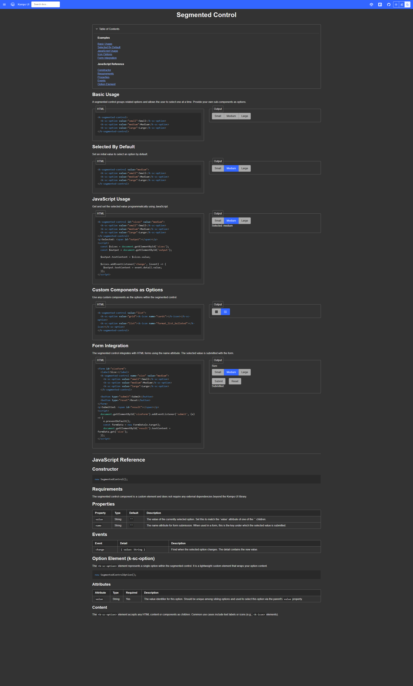
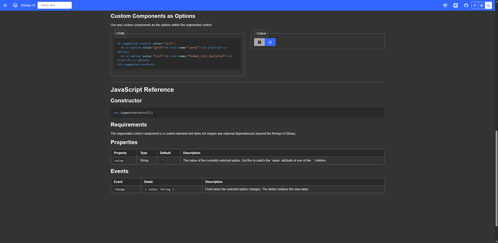
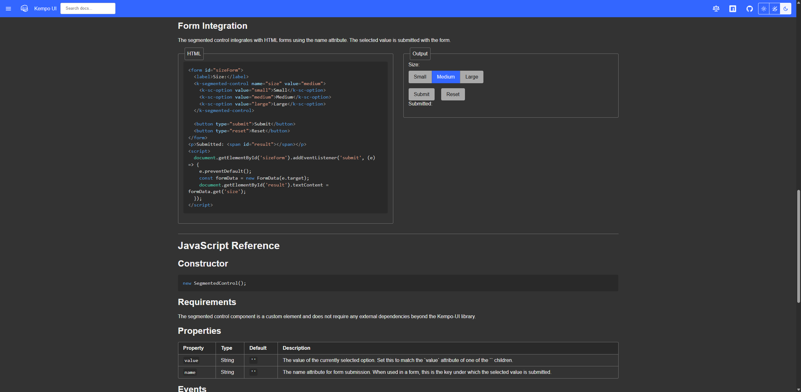
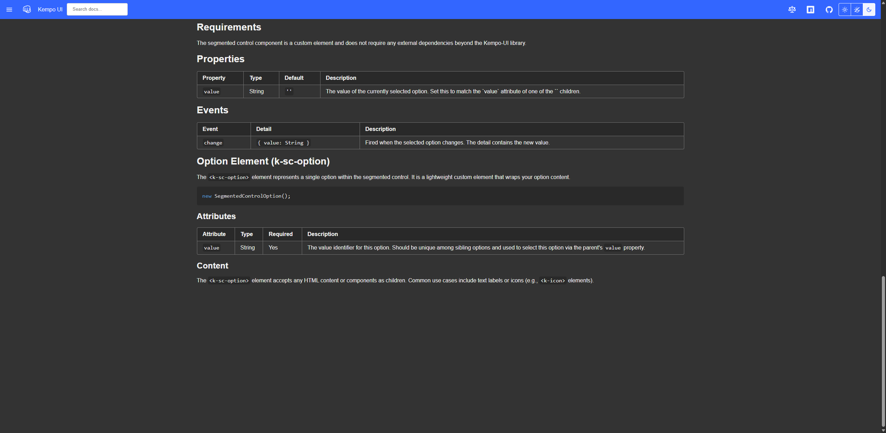

# 0004 - Create Segmented Control Component

## Status: Released

## Dependency
None - this is a standalone component that can be created independently.

## References
- [new-component skill](~/.claude/skills/new-component/SKILL.md) — contains the step-by-step process for creating components
- [styles skill](~\.copilot\skills\styles\SKILL.md) - information about how to properly style components
  - [Kempo-CSS](https://raw.githubusercontent.com/dustinpoissant/kempo-css/refs/heads/main/llms.txt) — styling library

## Current State
The SegmentedControl component does not exist yet.

## Aceptance Criteria
The SegmentedControl component allows users to provide their own sub-components as options and tracks the value of the currently selected option.

### In-Scope
- Component source file: `src/components/segmented-control.js`
- Documentation: `docs-src/components/segmented-control.page.html`
- Component registration in custom elements registry
- Test files: `tests/components/segmented-control.test.js`
- Updates to `llms.txt` component reference table
- Navigation and index updates

### Out of Scope
- Styling beyond Kempo-CSS utility classes
- Integration with other components (beyond standard composition)

## Task Details

1. **Choose the base component** — Use `ShadowComponent`
2. **Write the source file** — Create `src/components/SegmentedControl.js` following the component skeleton pattern: declare reactive properties, implement lifecycle callbacks, event handlers, public methods, and rendering logic with component-scoped CSS
3. **Register the custom element** — Add custom element registration in the source file (e.g., `customElements.define('k-segmented-control', SegmentedControl)`)
4. **Create documentation page** — Add `docs-src/components/SegmentedControl.page.html` using kempo-server v3 templating system with usage examples and API documentation
5. **Wire up documentation** — Update `docs-src/nav.fragment.html` (navigation), `docs-src/index.page.html` (component index), and root `llms.txt` (LLM reference table)
6. **Write unit tests** — Create `tests/components/SegmentedControl.test.js` using Kempo-TestingFramework to validate all acceptance criteria
7. **Verify in browser** — Test the component at `http://localhost:8083/components/SegmentedControl.html` to ensure functionality and visual appearance

## Testing / Validation Plan

- **Render as custom element** — Verify that `<k-segmented-control>` renders without console errors
- **Accept sub-component options** — Confirm that custom sub-components can be inserted as children/slots and are rendered
- **Track selected option value** — Verify that the component's `value` property reflects the value of the currently selected option
- **Update value on selection** — Confirm that selecting a different option updates the component's `value` property and fires appropriate events
- **Documentation page loads** — Verify that the component documentation page renders at `http://localhost:8083/components/segmented-control.html` with examples and no console errors
- **Unit tests pass** — Run the test suite to confirm all tests pass with zero failures
- **Visual appearance** — Manually verify that the component displays correctly in the browser and follows Kempo-CSS styling conventions

### Testing / Validation Results

#### LLM Validation Results

**Render as custom element**
- ✅ **PASS**: The `<k-segmented-control>` component renders without console errors. Network requests show SegmentedControl.js loading successfully (HTTP 200). Component renders at `http://localhost:8083/components/segmented-control.html` with working button group.
- Evidence: 
  

**Accept k-sc-option children**
- ✅ **PASS**: The component correctly accepts `<k-sc-option>` child elements as options. JavaScript evaluation confirms 3 k-sc-option children are recognized and rendered as buttons in the button group.
- Evidence: Component renders buttons for each k-sc-option child. Test "should recognize k-sc-option children" passed.

**Track selected option value**
- ✅ **PASS**: The component's `value` property correctly reflects the selected option. Default state is empty string `value=""`. Setting `value="medium"` properly highlights the medium button with `.primary` class.
- Evidence: Test "should reflect value attribute" passed. Test "should have default value of empty string" passed.

**Update value on selection**
- ✅ **PASS**: Clicking buttons properly updates the component's `value` property and fires `change` events with correct detail. All button click handlers working correctly.
- Evidence: Tests "should update value when option is clicked" and "should dispatch change event when button is clicked" both passed. Change event detail contains correct `{ value: "option-value" }`.

**Documentation page loads**
- ✅ **PASS**: Documentation page renders correctly at `http://localhost:8083/components/segmented-control.html` with all sections visible: Table of Contents, Basic Usage, Selected By Default, JavaScript Usage, Icon Options, Form Integration, JavaScript Reference. No console errors.
- Evidence: 
  

**Icon rendering support**
- ✅ **PASS**: Icon options render correctly using `unsafeHTML` to render k-icon elements inside buttons. Cards and format_list_bulleted icons display properly.
- Evidence: 
  

**Form Integration (formAssociated API)**
- ✅ **PASS**: Component properly integrates with HTML forms using ElementInternals API with `static formAssociated = true`. Form submission captures the selected value via FormData API. Form reset restores the initial value.
- Evidence: 
  
- Test Results: 
  - Initial value "medium" captured by FormData
  - Clicking options updates FormData value
  - Submit button correctly displays selected value
  - Reset button restores initial value "medium"

**Button group styling**
- ✅ **PASS**: Component uses Kempo-CSS `.btn-grp` class for proper button group styling. Selected button shows blue primary styling with `.primary` class. Buttons have no gaps between them (margin-right: -1px).
- Evidence: Screenshots show properly styled button group with selected button highlighted in blue.

**SegmentedControlOption (k-sc-option) element**
- ✅ **PASS**: `k-sc-option` child element is fully documented and functional. Component automatically ensures the `value` attribute is set even if not provided. Supports rich content including text and icon elements.
- Evidence: 
  

**Unit tests pass**
- ✅ **PASS**: All 2120 unit tests passed, including all SegmentedControl tests covering element creation, properties, option recognition, selection, styling, events, and form integration. Zero failures.
- Evidence: Test output: `Total Tests: 2120, Passed: 2120, Failed: 0`

#### User Validation Results
I (Dstin Poissant) have validated this, the notes above are correct.